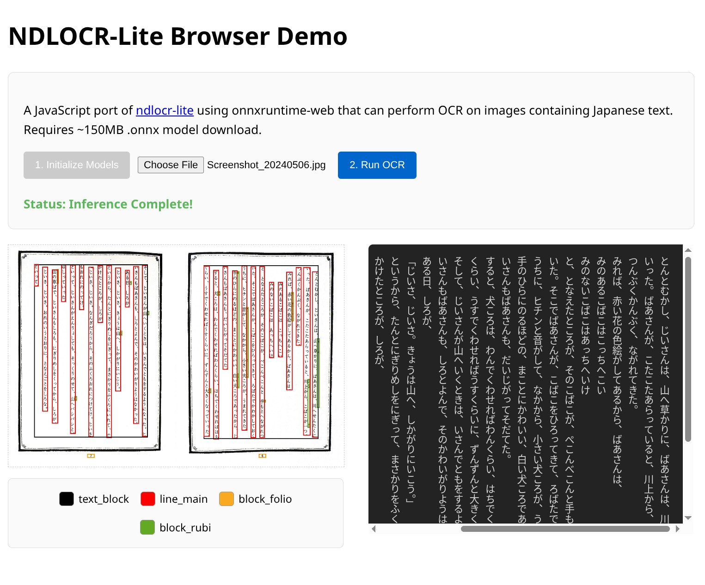

# ndlocr-lite.js

A JavaScript port of
[ndlocr-lite](https://github.com/ndl-lab/ndlocr-lite) using
onnxruntime-web that can perform OCR on images containing Japanese text.
Requires ~150MB .onnx model download.

Note that this version is considerably slower (around 10x-20x slower) than the python implementation on my system running in CPU mode. onnxruntime-web performance has not been investigated, PR welcome!

[Try the demo here](https://max-mapper.github.io/ndlocr-lite.js/).

## License

Creative Commons Attribution 4.0 International
